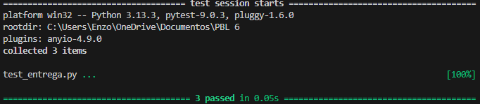
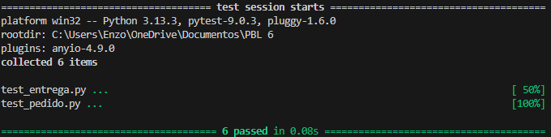
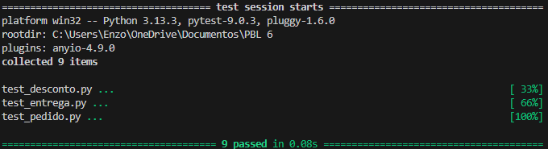

# Testes Unitários Automatizados e TDD — LocalEats

## Funcionalidade escolhida

### Cálculo de taxa de entrega

#### O que faz
Calcula o valor da taxa de entrega com base na distância do pedido.

#### Problema que resolve
Padroniza a cobrança de entrega e evita valores inconsistentes.

#### Importância
Impacta diretamente o valor final do pedido e a experiência do usuário.

#### Regras de negócio
- Distância até 3 km → taxa fixa
- Acima de 3 km → taxa proporcional
- Distância negativa → erro

---

## Testes Unitários

### Teste 1 — Taxa fixa até 3 km

Cenário:
Verifica se a taxa fixa é aplicada corretamente.

Entrada:
distancia = 2

Resultado esperado:
Retornar 5.

Código:

```python
def test_taxa_fixa_ate_3km():
    assert calcular_taxa_entrega(2) == 5
```

---

### Teste 2 — Taxa proporcional acima de 3 km

Cenário:
Verifica se a taxa proporcional é calculada corretamente.

Entrada:
distancia = 5

Resultado esperado:
Retornar 9.

Código:

```python
def test_taxa_proporcional():
    assert calcular_taxa_entrega(5) == 9
```

---

### Teste 3 — Erro para distância negativa

Cenário:
Verifica se a função impede distância inválida.

Entrada:
distancia = -1

Resultado esperado:
Gerar erro ValueError.

Código:

```python
def test_deve_gerar_erro_para_distancia_negativa():
    with pytest.raises(ValueError):
        calcular_taxa_entrega(-1)
```

---

## Aplicação do TDD

### 🔴 Red

Primeiramente, os testes foram escritos antes da implementação da função.

Nesse momento, os testes falharam porque a função `calcular_taxa_entrega` ainda não existia.

Isso ajudou a definir claramente o comportamento esperado da funcionalidade.

---

### 🟢 Green

Depois disso, foi implementado o código mínimo necessário para que os testes passassem.

A função passou a:
- validar distância negativa
- aplicar taxa fixa até 3 km
- calcular taxa proporcional acima de 3 km

Com isso, todos os testes passaram com sucesso.

---

### 🔵 Refactor

Após os testes passarem, o código foi reorganizado para melhorar:
- legibilidade
- organização
- clareza dos nomes

As melhorias foram realizadas sem quebrar os testes automatizados.

---

## Refatoração

Foram realizadas melhorias no código para aumentar a legibilidade e facilitar manutenção futura.

As principais melhorias foram:
- utilização de nomes mais claros
- melhor organização das condições
- simplificação da lógica da função

Os testes automatizados garantiram que as alterações não quebrassem o funcionamento da funcionalidade.

---

## Execução dos Testes

Total de testes executados: 3

Testes aprovados: 3

Testes com falha: 0

### Evidência

Adicionar print da execução dos testes mostrando os 3 testes aprovados.

---

## Reflexão no contexto do LocalEats

Inicialmente, escrever os testes antes da implementação foi diferente do desenvolvimento tradicional, mas ajudou a compreender melhor as regras de negócio.

O TDD contribuiu para desenvolver a funcionalidade com mais segurança e organização.

Os testes automatizados aumentaram a confiança no código e ajudam a evitar regressões após alterações futuras.

No contexto do LocalEats, essa abordagem ajuda a garantir maior estabilidade e qualidade das funcionalidades do sistema.



---

# Funcionalidade 2 

## Funcionalidade escolhida — Cálculo do total do pedido com valor mínimo

### O que faz
Calcula o valor total do pedido com base na soma dos itens adicionados.

### Problema que resolve
Evita pedidos abaixo do valor mínimo exigido pelo restaurante.

### Importância
Essa funcionalidade garante que os pedidos respeitem as regras de negócio do sistema.

### Regras de negócio
- O total do pedido deve ser a soma dos itens
- Se o valor total for menor que o valor mínimo, deve gerar erro
- Caso contrário, o pedido é válido

---

## Testes Unitários

### Teste 1 — Deve calcular corretamente o total do pedido

Cenário:
Verifica se o sistema soma corretamente os valores dos itens.

Entrada:
```python
itens = [{"preco": 10}, {"preco": 20}]
valor_minimo = 15
```

Resultado esperado:
Retornar 30.

Código:

```python
def test_deve_calcular_total_quando_valor_minimo_atingido():
    itens = [{"preco": 10}, {"preco": 20}]
    valor_minimo = 15

    resultado = calcular_total_pedido(itens, valor_minimo)

    assert resultado == 30
```

---

### Teste 2 — Deve retornar o valor exato do pedido

Cenário:
Verifica se o sistema retorna corretamente o valor total exato do pedido.

Entrada:
```python
itens = [{"preco": 25}, {"preco": 15}]
valor_minimo = 40
```

Resultado esperado:
Retornar 40.

Código:

```python
def test_deve_retornar_total_exato_do_pedido():
    itens = [{"preco": 25}, {"preco": 15}]
    valor_minimo = 40

    resultado = calcular_total_pedido(itens, valor_minimo)

    assert resultado == 40
```

---

### Teste 3 — Deve gerar erro quando valor mínimo não é atingido

Cenário:
Verifica se o sistema impede pedidos abaixo do valor mínimo.

Entrada:
```python
itens = [{"preco": 10}, {"preco": 5}]
valor_minimo = 30
```

Resultado esperado:
Gerar erro ValueError.

Código:

```python
def test_deve_gerar_erro_quando_valor_minimo_nao_atingido():
    itens = [{"preco": 10}, {"preco": 5}]
    valor_minimo = 30

    with pytest.raises(ValueError):
        calcular_total_pedido(itens, valor_minimo)
```

---

## Aplicação do TDD

### 🔴 Red

Os testes foram escritos antes da implementação da função, resultando inicialmente em falha.

---

### 🟢 Green

Foi implementado o código mínimo necessário para fazer os testes passarem.

---

### 🔵 Refactor

O código foi reorganizado para melhorar legibilidade e organização sem quebrar os testes.

---

## Refatoração

Foram realizadas melhorias:
- simplificação da lógica
- organização do código
- melhor legibilidade

Os testes automatizados ajudaram a garantir segurança durante as alterações.

---

## Execução dos Testes

Total de testes executados: 3

Testes aprovados: 3

Testes com falha: 0

### Evidência

Adicionar print da execução dos testes.

---

## Reflexão no contexto do LocalEats

Os testes automatizados ajudaram a validar as regras de negócio de forma rápida e segura.

O TDD auxiliou no entendimento da funcionalidade antes da implementação.

Essa abordagem ajuda o LocalEats a evitar regressões e manter maior estabilidade no sistema.



---

# Funcionalidade 3 — Aplicação de desconto percentual

## Funcionalidade escolhida

### O que faz
Aplica um desconto percentual sobre o valor total do pedido.

### Problema que resolve
Permite promoções e campanhas de desconto no sistema.

### Importância
Impacta diretamente o valor final pago pelo usuário.

### Regras de negócio
- O desconto deve estar entre 0% e 100%
- O valor final não pode ser negativo

---

## Testes Unitários

### Teste 1 — Deve aplicar desconto percentual corretamente

Cenário:
Verifica se o desconto é aplicado corretamente ao valor total.

Entrada:
```python
valor_total = 100
desconto = 10
```

Resultado esperado:
Retornar 90.

Código:

```python
def test_deve_aplicar_desconto_percentual_corretamente():
    resultado = aplicar_desconto(100, 10)

    assert resultado == 90
```

---

### Teste 2 — Deve retornar valor sem desconto

Cenário:
Verifica se o sistema mantém o valor original quando o desconto é 0%.

Entrada:
```python
valor_total = 200
desconto = 0
```

Resultado esperado:
Retornar 200.

Código:

```python
def test_deve_retornar_valor_sem_desconto():
    resultado = aplicar_desconto(200, 0)

    assert resultado == 200
```

---

### Teste 3 — Deve gerar erro para desconto inválido

Cenário:
Verifica se o sistema impede descontos inválidos.

Entrada:
```python
valor_total = 100
desconto = 150
```

Resultado esperado:
Gerar erro ValueError.

Código:

```python
def test_deve_gerar_erro_para_desconto_invalido():
    with pytest.raises(ValueError):
        aplicar_desconto(100, 150)
```

---

## Aplicação do TDD

### 🔴 Red

Os testes foram escritos antes da implementação da função, causando falha inicial.

---

### 🟢 Green

Foi implementado o código mínimo necessário para que os testes passassem.

---

### 🔵 Refactor

O código foi reorganizado para melhorar clareza e manutenção.

---

## Refatoração

Foram realizadas melhorias:
- simplificação da lógica
- melhor organização do código
- maior legibilidade

Os testes automatizados ajudaram a validar as alterações realizadas.

---

## Execução dos Testes

Total de testes executados: 3

Testes aprovados: 3

Testes com falha: 0

### Evidência

Adicionar print da execução dos testes.

---

## Reflexão no contexto do LocalEats

O TDD ajudou a compreender melhor as regras de desconto antes da implementação.

Os testes automatizados aumentaram a confiança no funcionamento da funcionalidade.

Essa abordagem ajuda o LocalEats a reduzir falhas e garantir maior qualidade no sistema.

