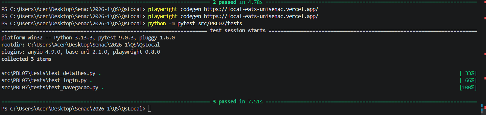

# 🧩 Atividade PBL – Aula 10  
## Testes Funcionais Automatizados – LocalEats

---

## 👥 Integrante(s)

- João Marcelo Bitar
- Enzo Sabbado
- João Pedro Millech

---

# 🔹 1. Fluxos funcionais escolhidos

## 📌 Login de usuário

🔎 **Descrição**  
Permite autenticar um usuário no sistema.

🎯 **Importância**  
Fluxo essencial para acesso às funcionalidades.

### 📏 Cenários testados
- Login válido
- Redirecionamento após login
- Acesso à página principal

---

## 📌 Navegação e visualização de restaurantes

🔎 **Descrição**  
Permite navegar pelos restaurantes disponíveis no sistema.

🎯 **Importância**  
Fluxo essencial para exploração dos restaurantes cadastrados.

### 📏 Cenários testados
- Carregamento da lista de restaurantes
- Visualização dos restaurantes disponíveis
- Abertura da página de um restaurante

---

## 📌 Visualização de detalhes de um restaurante

🔎 **Descrição**  
Permite visualizar os detalhes e cardápio de um restaurante específico.

🎯 **Importância**  
Fluxo importante para interação do usuário com os restaurantes.

### 📏 Cenários testados
- Nome do restaurante visível
- Carregamento do cardápio
- Visualização dos pratos disponíveis

---

## 🔹 2. Teste com Codegen

### 💻 Comando utilizado

```bash
playwright codegen https://local-eats-unisenac.vercel.app/
```

## 🔗 Link para os códigos gerados

👉 https://github.com/jpmilech/projeto-qualidade-software/tree/main/src

Os arquivos estão dentro de:

```text
src/PBL07/
```

### 🧠 Observações

- O Codegen ajudou a iniciar rapidamente os testes automatizados, principalmente na identificação dos elementos da interface e na geração inicial do fluxo.

- Mas o código gerado apresentou: comandos redundantes, baixa legibilidade, cliques desnescessários...

---

## 🔹 3. Teste automatizado com Pytest

### 🔗 Link para o teste

👉 https://github.com/seu-repositorio/tests/test_login.py

### 📌 O que o teste faz?

### Login
- acesso à tela de login
- preenchimento de email e senha
- autenticação do usuário

### Navegação
- carregamento da lista de restaurantes
- abertura de restaurante específico

### Detalhes do restaurante
- carregamento das informações
- visualização do cardápio
- validação dos elementos da página

---

## 🔹 4. Refatoração com Page Object Model (POM)

### 🔗 Link para Page Object

👉 https://github.com/seu-repositorio/pages/login_page.py

### 🔗 Link para teste refatorado

👉 https://github.com/seu-repositorio/tests/test_login.py

### 🧠 Melhorias realizadas

- Separação entre teste e lógica de UI  
- Código mais organizado  
- Maior reutilização  

---

## 🔹 5. Execução dos testes

### ▶️ Comando

```bash
python -m pytest src/PBL07/tests
```

### 📊 Resultado

- Total de testes: 3
- Testes aprovados: 3
- Testes falharam: 0 

### 📸 Evidência


---

## 🔹 6. Análise crítica

- Durante o desenvolvimento alguns testes falharam devido a seletores ambíguos baseados em texto. 

---

## 🔹 7. Reflexão

- Testes automatizados não substituem testes manuais:
    Os testes manuais ainda são importantes para: validações visuais, experiência do usuário, testes exploratórios

- Devem focar em fluxos críticos  
- Aumentam a confiança no sistema  

---

## 💡 Conclusão

A automação de testes com Playwright e Pytest permitiu validar os principais fluxos do sistema LocalEats de forma mais rápida e confiável. A utilização do padrão POM ajudou na organização e manutenção do código, tornando os testes mais reutilizáveis e legíveis. Além disso, a atividade demonstrou a importância dos testes automatizados para aumentar a qualidade e a confiança no sistema.