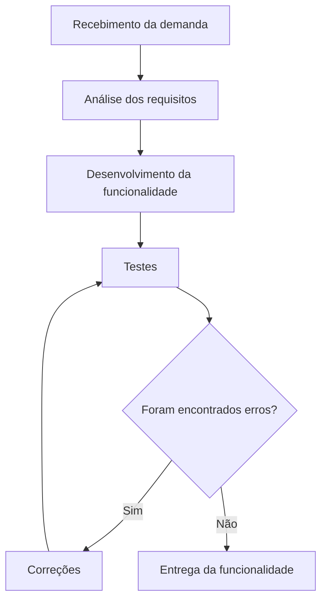

# Qualidade de Processo – LocalEats

## 1. Mapeamento do Processo Atual

O processo abaixo representa o fluxo utilizado pela equipe para desenvolver e validar funcionalidades do sistema LocalEats, desde o recebimento da demanda até a entrega da funcionalidade.

## 2. Identificação de Entradas, Atividades e Saídas

A tabela abaixo apresenta as principais etapas do processo de desenvolvimento utilizado pela equipe do LocalEats, indicando as entradas, atividades realizadas e as saídas geradas em cada fase.

| Etapa | Entrada | Atividade | Saída |
|-------|----------|-----------|-------|
| Recebimento da demanda | Solicitação de nova funcionalidade ou correção | Receber e registrar a demanda | Demanda registrada |
| Análise dos requisitos | Demanda registrada | Analisar os requisitos e definir o que será desenvolvido | Requisitos definidos |
| Desenvolvimento | Requisitos definidos | Implementar a funcionalidade no código | Funcionalidade desenvolvida |
| Testes | Funcionalidade desenvolvida | Executar testes para verificar o funcionamento | Erros identificados ou funcionalidade validada |
| Correções | Erros identificados | Corrigir os problemas encontrados nos testes | Código corrigido |
| Entrega | Funcionalidade validada | Disponibilizar a funcionalidade para uso | Funcionalidade entregue |

## 3. Reflexão sobre o Processo

### O processo utilizado pela equipe está claramente definido?

Sim. A equipe segue um fluxo organizado, iniciando pelo recebimento da demanda, passando pela análise dos requisitos, desenvolvimento, testes, correções quando necessárias e, por fim, a entrega da funcionalidade. Esse processo contribui para uma melhor organização do trabalho.

### Todos os integrantes seguem o mesmo fluxo de trabalho?

Sim. A equipe procura seguir o mesmo processo para desenvolver as funcionalidades, garantindo que todas as etapas sejam realizadas de forma padronizada e facilitando a colaboração entre os integrantes.

### Em quais etapas a qualidade é verificada?

A qualidade é verificada principalmente durante a análise dos requisitos, na execução dos testes e na etapa de correções. Essas fases ajudam a identificar e corrigir problemas antes da entrega da funcionalidade.

### Quais melhorias poderiam tornar o processo mais eficiente?

O processo pode ser melhorado com a realização de revisões de código entre os integrantes, maior automação dos testes e definição mais detalhada das tarefas antes do desenvolvimento. Essas práticas ajudam a reduzir erros e retrabalho.

### Como a qualidade do processo impacta a qualidade do produto final?

Um processo bem organizado reduz falhas, melhora a comunicação da equipe e aumenta a confiabilidade do software. Como consequência, o produto final tende a apresentar menos defeitos e oferecer uma melhor experiência aos usuários.

---

## Conclusão

A qualidade do processo é fundamental para o desenvolvimento de um software confiável. Ao seguir um fluxo organizado, realizar testes e corrigir problemas antes da entrega, a equipe aumenta a qualidade do produto final e reduz a ocorrência de falhas durante sua utilização.